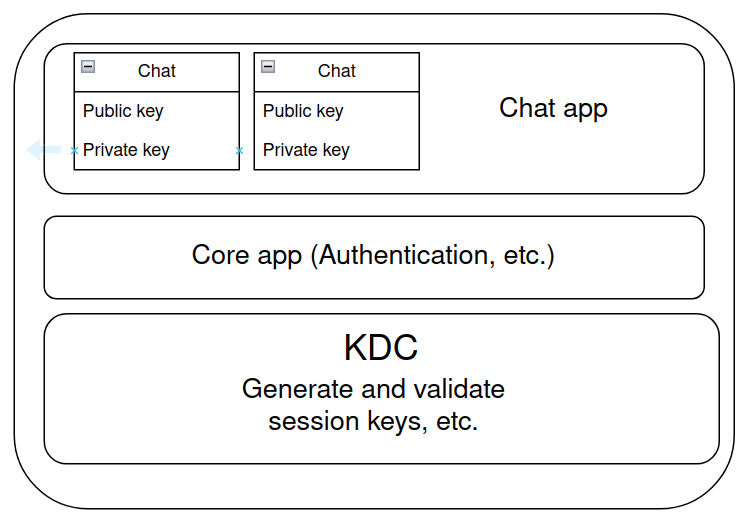
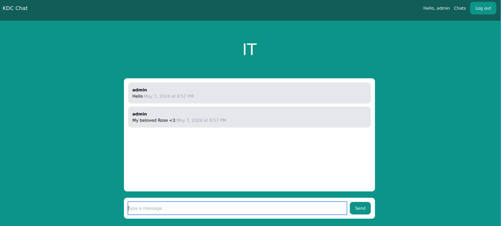

# Key Distribution Center for Caesar cipher using RSA


This project is a real-time chat application built with Django that includes a Key Distribution Center (KDC) for Caesar cipher using our own RSA implementation from PW8-9 (`MiniRSA`). The KDC is responsible for generating and validating session keys for users. The chat application uses these session keys to encrypt and decrypt messages.

It includes:
- User registration and authentication by utilizing Django's default `User` model
- Stores model fields, including public keys and RSA key pairs in SQLite database (`db.sqlite3`)
- Can generate random session keys on request
- Real-time chat functionality using Websockets

## Project Structure

The project is structured as a Django application with the following main components:

- `kdc_chat/`: The main Django project directory.
- `chat/`: The Django app responsible for handling chat-related functionality, such as Websocket connections.
- `core/`: The Django app responsible for handling core functionality like user registration and authentication
- `kdc/`: The Django app responsible for handling key distribution center functionality like session key generation and validation.

## Key models

### Chat

The `Chat` model represents a chat room. Each chat room has a unique slug and an RSA key pair.

### ChatConsumer

The `ChatConsumer` handles WebSocket connections for the chat rooms.

### CaesarConnection

The `CaesarConnection` model represents a connection between a user and a chat room. It contains the Caesar cipher key for that connection.

### SessionKey

The `SessionKey` model represents a session key generated by the KDC. 

## Usage

1. Activate the virtual environment by running

```sh
$ source venv/bin/activate
```

2. Navigate to the project directory.
3. Run the Django server using the command:

```sh
$ python manage.py runserver
```

## How it works

1. If this is the first time a user is accessing the chat, they need to generate a `CaesarConnection` by requesting a session key from the KDC, encrypting it with the chat's public key, and sending it back to the KDC for validation.
2. After validation by the KDC that the session key is valid, the server will send back the Caesar key encrypted with the user's public key.
3. The user will then decrypt the Caesar key with their private key and use it to encrypt messages.
4. If a user already has a `CaesarConnection` with the given chat, they can retrieve the Caesar key which was agreed upon.

## Showcase
